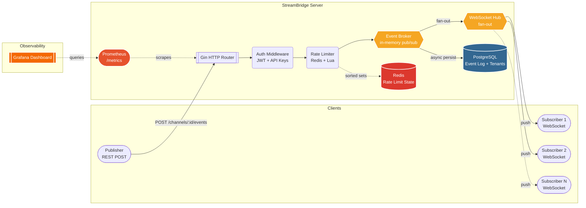

# StreamBridge


**StreamBridge** is a high-performance, multi-tenant event broker built in Go. It provides a RESTful API for ingesting events and fans them out in real-time to hundreds of concurrent WebSocket clients, with an architecture designed to scale horizontally. 

Designed for horizontal scaling through stateless application instances and shared Redis/PostgreSQL infrastructure.

## 🚀 Key Features

- **Fan-out Throughput**: Sustained ~40K WebSocket message deliveries/sec in local k6 benchmarks.
- **Multi-Tenant Architecture**: Strict logical isolation between tenants using `tenant_id` scopes.
- **Concurrent Hub Architecture**: Optimized WebSocket broadcasting with buffered client queues and slow-consumer eviction.
- **Channel-based Design**: Thread-safe channel-based event loop minimizes shared-state contention during heavy event broadcasting.
- **Distributed Rate Limiting**: Redis-backed sliding window rate limits protect the broker from noisy neighbors.
- **Robust Observability**: Built-in Prometheus metrics (`/metrics`) and standard health/readiness probes.

---

## 🏗 Architecture

StreamBridge leverages a pure Go architecture optimized for concurrent I/O:
- **Go 1.25**
- **Gin** (HTTP Routing)
- **Gorilla WebSocket** (Real-time Streaming)
- **PostgreSQL 16** (Tenants, Channels, and Event Durability)
- **Redis 7** (Distributed Rate Limiting & Counters)
- **Prometheus** (Metrics)
- **Grafana** (Real-time telemetry and dashboards)

### The Big Picture



---

## ⚡ Performance & Benchmarks

A custom `k6` load testing suite validates StreamBridge's performance limits. 

**Local Development Environment Benchmark Results:**
- **Concurrent Load**: 500 simultaneous WebSocket clients and 100 continuous HTTP publishers.
- **Sustained Fan-out**: **~40.7K WebSocket message deliveries/sec**.
- **Total Deliveries**: **1.45+ Million** messages routed in 30 seconds.
- **Failure Rate**: **0.00%** HTTP request failures.
- **Publish Latency**: Sub-20 ms median ingest time.

For full benchmark details, see [BENCHMARKS.md](BENCHMARKS.md).

---

## 🛠 Quickstart

Start the infrastructure and the application using Docker Compose:

```bash
# 1. Clone the repository
git clone https://github.com/Anshum77/StreamBridge.git
cd StreamBridge

# 2. Copy the environment variables
cp .env.example .env

# 3. Spin up the infrastructure (Postgres, Redis, Prometheus, Grafana, App)
docker compose up -d

# 4. (Optional) Follow the application logs
docker compose logs -f app
```

The StreamBridge API is now running on `http://localhost:8080`.

---

## 📖 API Reference

### Administration
*(Requires `Authorization: Bearer <ADMIN_API_KEY>`)*
- `POST /admin/tenants` - Create a new tenant
- `POST /admin/tenants/:id/keys` - Generate a new API key for a tenant

### Channels
*(Requires `Authorization: Bearer <TENANT_API_KEY>`)*
- `GET /channels` - List all channels
- `POST /channels` - Create a new channel
- `GET /channels/:id` - Get channel details
- `PUT /channels/:id` - Update a channel
- `DELETE /channels/:id` - Delete a channel

### Events
*(Requires `Authorization: Bearer <TENANT_API_KEY>`)*
- `POST /channels/:id/events` - Publish a JSON event to a specific channel
- `GET /channels/:id/events` - Replay historical events (using `?last_seen_offset=`)

### Streaming
*(Requires `Authorization: Bearer <TENANT_API_KEY>`)*
- `GET /channels/:id/ws` - Connect to a channel's real-time event stream via WebSocket (supports `?last_seen_offset=`)

### Observability
- `GET /health` - Liveness probe
- `GET /ready` - Readiness probe (checks DB & Redis connectivity)
- `GET /metrics` - Prometheus metrics

---

## 📁 Project Structure

```text
StreamBridge/
├── cmd/
│   └── server/          # Application entrypoint
├── config/              # Environment configuration loader
├── database/            # PostgreSQL connection management
├── internal/
│   ├── broker/          # In-memory pub/sub structures
│   ├── handler/         # Gin HTTP route handlers
│   ├── hub/             # WebSocket connection manager and fan-out
│   ├── middleware/      # Rate Limiting and API Key Auth
│   ├── model/           # Database models (Tenant, Channel, Event)
│   ├── repository/      # PostgreSQL data access layer
│   └── metrics/         # Prometheus telemetry instrumentation
├── loadtest/            # k6 benchmarking scripts
├── migrations/          # Golang-migrate SQL definitions
├── docker-compose.yml   # Local infrastructure
├── Dockerfile           # Multi-stage production build
└── go.mod               # Go module dependencies
```

---

## 🚦 Load Testing

Want to run the benchmarks yourself? Install [k6](https://k6.io/) and run the custom suite:

```bash
k6 run -e ADMIN_API_KEY=super-secret-admin-key loadtest/benchmark.js
```

---

## 📄 License

This project is licensed under the MIT License - see the [LICENSE](LICENSE) file for details.
